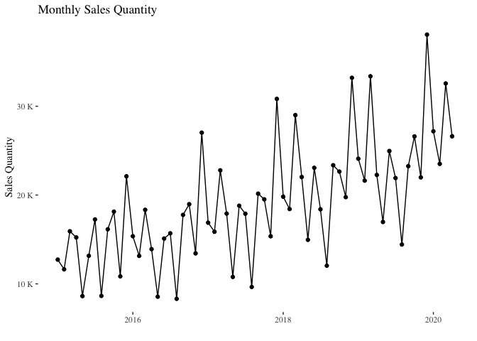
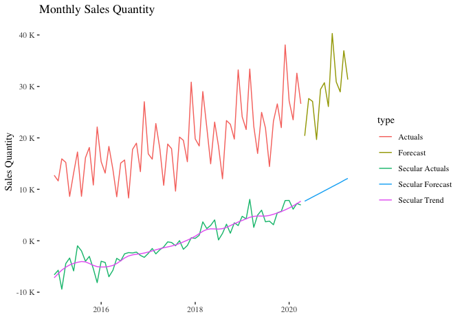

Subject Expert Forecasting Framework
================
Andy Wentland
2023-07-17

### Load and clean data

``` r
training_data <- read.csv2("Month_Value_1.csv", sep = ",")
training_data$Date <- as.Date(training_data$Period, "%d.%m.%Y")
training_data$Month <- format.Date(training_data$Date, "%m")
training_data$Revenue <- as.numeric(training_data$Revenue)
training_data$Average_cost <- as.numeric(training_data$Average_cost)
training_data <- training_data %>% filter(Date <= '2020-04-01')
```

### Plot data

``` r
ggplot(data=training_data, aes(x=Date, y=Sales_quantity, group=1)) +
  geom_line()+
  geom_point()+
  ggthemes::theme_tufte() +
  labs(title="Monthly Sales Quantity", x = "", y = "Sales Quantity") + 
  scale_y_continuous(labels = unit_format(unit = "K", scale = 1e-3))
```

<!-- -->

## Model Evaluation Metrics

``` r
# Mean squared error
mse <- function(model) {
  error <- mean((model$actual - model$predicted)^2)
  return(error)
}

# Mean absolute error
mae <- function(model) {
  error <- mean(abs(model$actual - model$predicted))
  return(error)
}

# Root mean squared error
rmse <- function(model) {
  error <- sqrt(mean((model$actual - model$predicted)^2))
  return(error)
}

# Mean absolute percent error
mape <- function(model) {
  error <- mean(abs((model$actual - model$predicted) / model$actual))
  return(error)
}

# Median absolute percent error
medape <- function(model) {
  error <- median(abs((model$actual - model$predicted) / model$actual))
  return(error)
}

# Symmetric mean absolute percentage error
smape <- function(model) {
  error <- mean(abs(model$actual - model$predicted) / ((abs(model$actual) + abs(model$predicted)) / 2))
  return(error)
}

# Mean absolute scaled error
mase <- function(model, step_size) {
  error <- Metrics::mase(model$actual, model$predicted, step_size = step_size)
  return(error)
}

run_mpe <- function(model_results, step_size) {
  mpe_df <- data.frame(mse=mse(model_results), 
                       mae=mae(model_results), 
                       rmse=rmse(model_results),
                       mape=mape(model_results)*100,
                       medape=medape(model_results)*100,
                       smape=smape(model_results)*100,
                       mase=mase(model_results, 12))
  return(mpe_df)
}
```

## Secular Forecast Methods

``` r
secular_trend_methods <- function(secular_method, secular_trend_lookback, secular_trend_lookback_index){
  if (secular_method == 'linear_regression'){
    secular_trend_lookback <- tail(secular_trend,secular_trend_lookback_period)
    secular_trend_lookback_index <- 1:secular_trend_lookback_period
    
    secular_trend_lookback_lm <- lm(secular_trend_lookback~secular_trend_lookback_index)
    secular_trend_lookback_slope <- secular_trend_lookback_lm$coefficients[2]
    
    secular_trend_forecast <- seq(tail(secular_trend,1), by = secular_trend_lookback_slope, length.out = forecast_horizon)
    

  } else if (secular_method == 'moving_average'){
    
    #TODO add moving average method
    
  } else {
    
    #TODO add other secular forecasting methods
    
  }
 
  return(secular_trend_forecast)
   
}
```

## Two Stage Model

``` r
runTwoStageModel <- function(training_data, model_type, dependent_var, independent_vars, forecast_horizon, 
                             secular_trend_lookback_period, secular_smoothing_strength, secular_forecast_method, mpi_cores) {
  
  cl <- makePSOCKcluster(mpi_cores)
  registerDoParallel(cl)
  
  stage1_model_equation <- as.formula(paste(dependent_var,"~", paste(independent_vars, collapse="+")))
  stage2_independent_vars <- append(independent_vars,'secular_trend')
  stage2_model_equation <- as.formula(paste(dependent_var,"~", paste(stage2_independent_vars, collapse="+")))
  
  # Stage 1 Model Seasonal predictors only
  # TO-DO: Implement glm & caret's train function for regressions
  #stage1_model_caret <<- train(model_equation, data = training_data, method = "glm", family = "gaussian")
  #stage1_model_glm <<- glm(model_equation,data=training_data,family=gaussian(link = "identity"))
  stage1_model <- lm(stage1_model_equation, data = training_data) 
  
  # Stage 1 Residuals
  stage1_model_residuals <- as.data.frame(stage1_model$residuals) %>% setNames(c("residuals"))
  stage1_model_residuals$index <- 1:nrow(stage1_model_residuals)
  
  # Loess Model to smooth Stage 1 residuals to create secular trend
  loessModel <- loess(residuals ~ index, data=stage1_model_residuals, span=secular_smoothing_strength)
  secular_trend <- predict(loessModel) 
  
  # Stage 2 Model. Seasonal predictors + secular trend
  stage2_model <- lm(stage2_model_equation, data = training_data)
  
  # Create future secular trend by taking a linear regression of user defined historical period
  secular_trend_lookback <- tail(secular_trend,secular_trend_lookback_period)
  secular_trend_lookback_index <- 1:secular_trend_lookback_period
  
  secular_trend_lookback_lm <- lm(secular_trend_lookback~secular_trend_lookback_index)
  secular_trend_lookback_slope <- secular_trend_lookback_lm$coefficients[2]
  
  secular_trend_future <- seq(tail(secular_trend,1), by = secular_trend_lookback_slope, length.out = forecast_horizon)
  
  future_dates <- tail(seq(tail(training_data$Date,1), length.out = forecast_horizon+1, by = "month"),forecast_horizon)
  future_months <- as.character(format.Date(future_dates, "%m"))
  
  # Stage 2 Model Forecast
  future_predict_df <- data.frame(Month = future_months, secular_trend = secular_trend_future)
  stage2_forecast <- predict(stage2_model, future_predict_df)
  
  # Combine historicals and forecasted data
  historicals_df <- data.frame(Date = training_data$Date, Sales_quantity = training_data$Sales_quantity, type='Actuals')
  predicted_df <- data.frame(Date = future_dates, Sales_quantity = stage2_forecast, type='Forecast')
  historical_secular_df <- data.frame(Date = training_data$Date, Sales_quantity = stage1_model_residuals$residuals, type='Secular Actuals')
  historical_secular_trend_df <- data.frame(Date = training_data$Date, Sales_quantity = secular_trend, type='Secular Trend')
  forecasted_secular_trend_df <- data.frame(Date = future_dates, Sales_quantity = secular_trend_future, type='Secular Forecast')
  model_output_df <- rbind(historicals_df, predicted_df, historical_secular_df, historical_secular_trend_df, forecasted_secular_trend_df)
  
  model_pred_actual_vals <- data.frame(actual =  stage2_model$model$Sales_quantity, 
                   predicted = stage2_model$fitted.values)
  
  twostage_output <- list(model_output_df=model_output_df, 
                          model_pred_actual_vals=model_pred_actual_vals,
                          stage2_model=stage2_model)  
  
  # Stop MPI
  stopCluster(cl)
  
  return(twostage_output)
}
```

## Model Settings & Results

``` r
# Forecast & Secular Trend Settings
independent_vars <- c("Month")
dependent_var <- "Sales_quantity"
model_type <- 'glm_gaussian_identity' # glm algorithm
forecast_horizon <- 12 # time periods to forecast
secular_trend_lookback_period <- 6
secular_smoothing_strength <- 0.33
secular_forecast_method <- 'linear_regression'
mpi_cores <- 4 # Register cores for MPI

# Run Model
twostage_output <- runTwoStageModel(training_data, model_type, dependent_var, independent_vars, forecast_horizon, secular_trend_lookback_period, secular_smoothing_strength, secular_forecast_method, mpi_cores)

# Visualize
ggplot(data=twostage_output$model_output_df, aes(x=Date, y=Sales_quantity, color=type)) +
  geom_line()+
  ggthemes::theme_tufte() +
  labs(title="Monthly Sales Quantity", x = "", y = "Sales Quantity") + 
  scale_y_continuous(labels = unit_format(unit = "K", scale = 1e-3))
```

<!-- -->

``` r
# Run model performance evaluation. Step size to calculate mean absolute scaled error
knitr::kable(run_mpe(twostage_output$model_pred_actual_vals, 12), caption = "Model Performance Evaluation")
```

|     mse |      mae |     rmse |     mape |   medape |    smape |      mase |
|--------:|---------:|---------:|---------:|---------:|---------:|----------:|
| 1541207 | 929.0404 | 1241.454 | 5.182628 | 3.402048 | 5.190289 | 0.3551874 |

Model Performance Evaluation

``` r
summary(twostage_output$stage2_model)
```

    ## 
    ## Call:
    ## lm(formula = stage2_model_equation, data = training_data)
    ## 
    ## Residuals:
    ##     Min      1Q  Median      3Q     Max 
    ## -3477.7  -605.7   193.0   632.0  3657.8 
    ## 
    ## Coefficients:
    ##                 Estimate Std. Error t value Pr(>|t|)    
    ## (Intercept)    1.990e+04  5.682e+02  35.015  < 2e-16 ***
    ## Month02       -2.354e+03  8.031e+02  -2.931  0.00505 ** 
    ## Month03        5.241e+03  8.035e+02   6.523 3.09e-08 ***
    ## Month04       -7.668e+02  8.042e+02  -0.953  0.34487    
    ## Month05       -7.247e+03  8.421e+02  -8.606 1.66e-11 ***
    ## Month06       -4.001e+02  8.421e+02  -0.475  0.63673    
    ## Month07       -1.365e+03  8.422e+02  -1.621  0.11116    
    ## Month08       -9.177e+03  8.423e+02 -10.894 6.42e-15 ***
    ## Month09        1.622e+02  8.425e+02   0.193  0.84807    
    ## Month10        1.058e+03  8.427e+02   1.255  0.21524    
    ## Month11       -3.982e+03  8.430e+02  -4.724 1.85e-05 ***
    ## Month12        9.811e+03  8.434e+02  11.633 5.80e-16 ***
    ## secular_trend  1.006e+00  4.259e-02  23.629  < 2e-16 ***
    ## ---
    ## Signif. codes:  0 '***' 0.001 '**' 0.01 '*' 0.05 '.' 0.1 ' ' 1
    ## 
    ## Residual standard error: 1391 on 51 degrees of freedom
    ## Multiple R-squared:  0.964,  Adjusted R-squared:  0.9555 
    ## F-statistic: 113.7 on 12 and 51 DF,  p-value: < 2.2e-16
